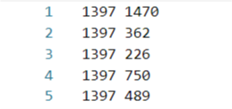

# Veried Graph Embeddings

[](https://github.com/shenweichen/graphembedding/issues)
[](https://codecov.io/gh/shenweichen/graphembedding)
[](https://www.codacy.com/gh/shenweichen/GraphEmbedding/dashboard?utm_source=github.com&amp;utm_medium=referral&amp;utm_content=shenweichen/GraphEmbedding&amp;utm_campaign=Badge_Grade)

This project is a modified version of [GraphEmbedding](https://github.com/shenweichen/GraphEmbedding), primarily addressing environment dependency issues to ensure smooth operation in Python environments (updated in 2024/11/19).

## Modifications
Due to incompatible package versions specified in the original setup.py file (updated in 2022), a new `experiment.yml` file was successfully debugged and output on 2024/11/19. You can use this file to create a conda environment with the correct package versions and ignore the original `setup.py` file.

## Installation
### Quick Setup
For a quick setup, use the simplified configuration file:
```bash
conda env create -f environment-brief.yml
```

### Exact Configuration (Recommended)
If you encounter any environment setup issues, please use the complete configuration file:
```bash
conda env create -f environment-full.yml
```

- Activate environment: `conda activate graph_embedding`
- Run examples from the example folder:
```bash
cd examples
python deepwalk_wiki.py
```

## Supported Algorithms

|   Model   | Paper                                                                                                                      | Reference                                                                                    |
| :-------: | :------------------------------------------------------------------------------------------------------------------------- | :------------------------------------------------------------------------------------------ |
| DeepWalk  | [KDD 2014][DeepWalk: Online Learning of Social Representations](http://www.perozzi.net/publications/14_kdd_deepwalk.pdf)   | [【Graph Embedding】DeepWalk: Algorithm Principles, Implementation and Application](https://zhuanlan.zhihu.com/p/56380812)  |
| LINE    | [WWW 2015][LINE: Large-scale Information Network Embedding](https://arxiv.org/pdf/1503.03578.pdf)                          | [【Graph Embedding】LINE: Algorithm Principles, Implementation and Application](https://zhuanlan.zhihu.com/p/56478167)      |
| Node2Vec  | [KDD 2016][node2vec: Scalable Feature Learning for Networks](https://www.kdd.org/kdd2016/papers/files/rfp0218-groverA.pdf) | [【Graph Embedding】Node2Vec: Algorithm Principles, Implementation and Application](https://zhuanlan.zhihu.com/p/56542707)  |
| SDNE    | [KDD 2016][Structural Deep Network Embedding](https://www.kdd.org/kdd2016/papers/files/rfp0191-wangAemb.pdf)               | [【Graph Embedding】SDNE: Algorithm Principles, Implementation and Application](https://zhuanlan.zhihu.com/p/56637181)      |
| Struc2Vec | [KDD 2017][struc2vec: Learning Node Representations from Structural Identity](https://arxiv.org/pdf/1704.03165.pdf)        | [【Graph Embedding】Struc2Vec: Algorithm Principles, Implementation and Application](https://zhuanlan.zhihu.com/p/56733145) |

## Usage Guide

All models follow a simple design principle (**graph in, embedding out**).

### Input Format
We use `networkx` to create graphs. The input edge list format is as follows:
`node1 node2 <edge_weight>`



### Example Code

Basic usage examples for DeepWalk model:

#### DeepWalk
```python
G = nx.read_edgelist('../data/wiki/Wiki_edgelist.txt',create_using=nx.DiGraph(),nodetype=None,data=[('weight',int)])
model = DeepWalk(G,walk_length=10,num_walks=80,workers=1)
model.train(window_size=5,iter=3)
embeddings = model.get_embeddings()
```

Usage of other model examples remain unchanged... See https://github.com/shenweichen/GraphEmbedding for details.

## License
This project is licensed under the MIT License.

Original work Copyright (c) 2019 Weichen Shen

Modified work Copyright (c) 2024 KittyIsGreat

## Acknowledgments
Special thanks to [shenweichen](https://github.com/shenweichen) for the original open-source contribution. 
